<head>
<link rel="SHORTCUT ICON" href="shaart_logo.jpg" />
<link rel="image_src" href="http://hedges.belmont.edu/~shawley/SHAART/images/shaart_logo.jpg" />
<meta property="og:image" content="http://hedges.belmont.edu/~shawley/SHAART/images/shaart_logo.jpg" />
<meta property="og:url" content="http://hedges.belmont.edu/~shawley/SHAART" />
<meta property="og:title" content="SHAART Acoustic Tools" />
<meta property="og:image" content="http://hedges.belmont.edu/~shawley/SHAART/images/rt60.png">
<meta name="twitter:card" content="summary_large_image">
<meta name="twitter:image" content="http://hedges.belmont.edu/~shawley/SHAART/images/rt60.png">
<meta keywords="audio acoustics analysis python education">
</head>
<body>

# SHAART Acoustic Tools

Main web page: http://hedges.belmont.edu/~shawley/SHAART<br>
GitHub page: http://github.com/drscotthawley/SHAART<br>

<p align="center">
SHAART Acoustic Tools, v 0.7<br>
(April 6, 2020)<br>
<br>
(yes, the name is a joke)<br>
<a href="#about">About</a> &nbsp;&nbsp;
<a href="#features">Features</a> &nbsp;&nbsp;
<a href="#downloads">Downloads</a> &nbsp;&nbsp;
<a href="#license">License</a> &nbsp;&nbsp;
<a href="#tutorial">Tutorial(s)</a> &nbsp;&nbsp;
<a href="#screenshots">Screenshots</a> &nbsp;&nbsp;
<a href="#source">Running From Source</a>  &nbsp;&nbsp;
<a href="#build">Building an Executable</a>  &nbsp;&nbsp;
<a href="#faq">FAQ</a> &nbsp;&nbsp;
<a href="#notes">Release Notes</a> &nbsp;&nbsp;
<br><br>
</p>


<a name="about"></a>

## About

This lightweight audio analysis suite was initially written <b><i>for educational purposes only</i></b>
over a period of 4 days.  (And then improved in bits.)  It's amazing how much you can accomplish with minimal knowledge of Python programming!

The name "SHAART" uses the author's initials (S.H.) in homage to the famous "SMAART" set of acoustics analysis tools by Rational Acoustics, Inc.  ...That and "SHAART" is just hilarious to say, for other reasons.  *(Note: "homage" = parody, derivative work = fair use = please don't sue.)*


<a name="features"></a>

## Features

Most of these features are illustrated in the <a href="#screenshots">Screenshots</a> section further down this page.

* **RT60 Measurement:** The reason SHAART was written in the first place.  Load an audio file, filter in different octave bands, draw a "best fit" line on the graph by hand, read off the reverb time.  (Designed to mimic functionality of SMAART Acoustics Tools(tm).)  Can show two files ("File A" and "File B") at once.  See "Tutorial(s)" below for a demo.
* **Waveform Display:** Linear scale only.  Displays two waveforms ("File A" and "File B") at once.
* **Power Spectrum:** Pretty standard display Doesn't do a log scale yet, though I'd like to add that.  Displays two spectra ("File A" and "File B" at once.)
* **Spectrogram:**  Shows magnitude as color, vs frequency and time. as with Power Spectrum.  Offers a few colormaps.  No log freq scale yet.  Only one file ("File A") shown.
* **Waterfall Plot:**  Alternative to Spectrogram, shows magnitude surface a function of time & frequency.   No log freq scale yet.  Only one file ("File A") shown.
* **"Inverse Spectrogram" (Image-To-Audio):**  Import an image, output audio for which the spectrogram will resemble that image.  Sounds a little "phasey," could be cleaner.  Useful for demonstrating audio effects.  See "Screenshots," below.
* **Room Mode Calculator:**  Uses the Rayleigh equation for standing waves of a 3D box, and also plots a "Fake Room Response" by assigning relative amplitudes to axial, tangential, and oblique modes.  Useful for demonstrating mode distributions for different room shapes.
* **Sabine Equation Calculator:** Assumes a box-shaped room, lets you apply absorption to different surfaces.  Based on Chapter 8 of Berg & Stork textbook, including their table for absorption coefficients.
* **Equation-to-Audio:** Specify a time-dependent function, and it'll generate audio from that. Useful for sine sweeps, e.g. for building impulse responses using Convolution (below)
* **Convolution:** Convolve File A with File B.  Useful for making impulse responses from sine sweeps, or just for screwing around (e.g. convolving Led Zeppelin's "The Ocean" with the sound of a dog bark.)
* **Play(/Record):** Very rudimentary.  Will play the audio out the speaker, with no controls.  Record doesn't work yet.


<a name="downloads"></a>

## Downloads

* [Mac Binary application](https://hedges.belmont.edu/~shawley/SHAART/SHAART.app.tar.gz) (337 MB)

*  [Windows executable](https://drive.google.com/open?id=1Uui3-MYnnKWeCFG181jmMPeGF2YPwPVP) (361 MB). Note that the Windows EXE takes *a while* to come up when you first run it.
* [Linux executable](https://drive.google.com/file/d/1uE_1x8ZCXI1bpQY5EamCEqUT2PUCLzYg/view?usp=sharing) (132 MB, Pop!\_OS / Ubuntu).  You can also <a href="#source">run from source</a> (below)
* [Source code (GitHub)](http://github.com/drscotthawley/SHAART) (in Python)  See <a href="#source">Running From Source</a> below for further instructions.
* [Sample WAV file](audio/sample_data.wav)


<a name="license"></a>

## License

2013 - 2019: This software is both "Open Source" and "Free," released under the Jesus license: "Freely you have received, freely give" (Matthew 10:8). Do as you like.  Modify, redistribute, etc.  

2020+: Consider this a Creative Commons License.


<a name="tutorial"></a>

## Tutorial(s)

* **How to use the App:**  Go up to the "File" tab and select a WAV file to analyze.

  Note: You don't need a WAV file to use the room mode calculator.

*  **TODO:** Measuring Reverb Times with SHAART(docs/rt60.html)

* [Creating Impulse Responses with SHAART](docs/ir.html)


<a name="screenshots"></a>

## Screenshots

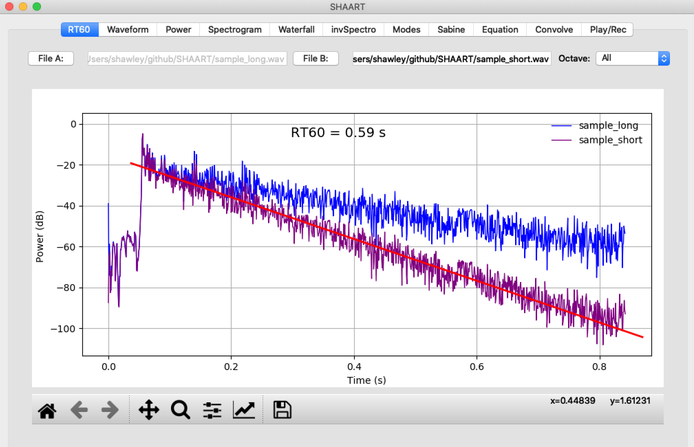

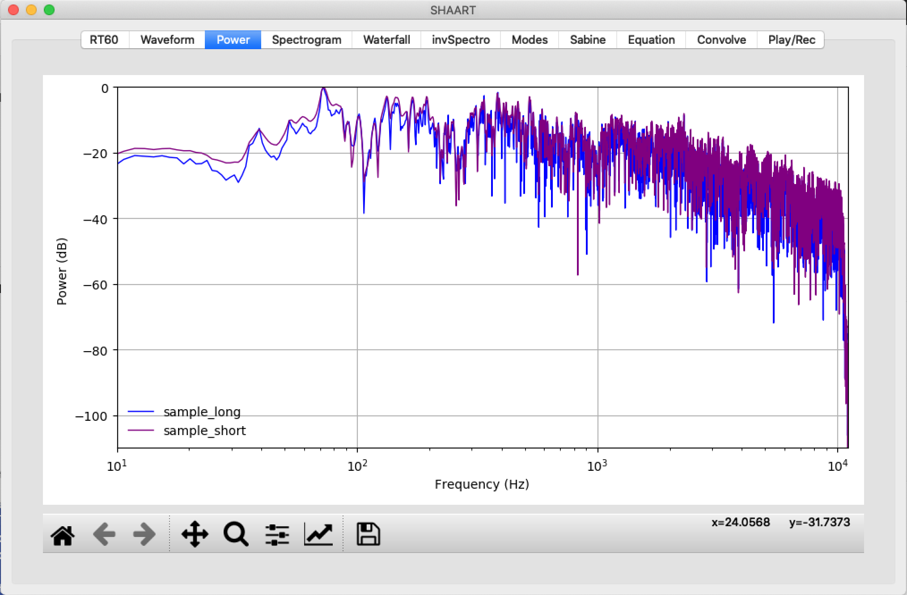

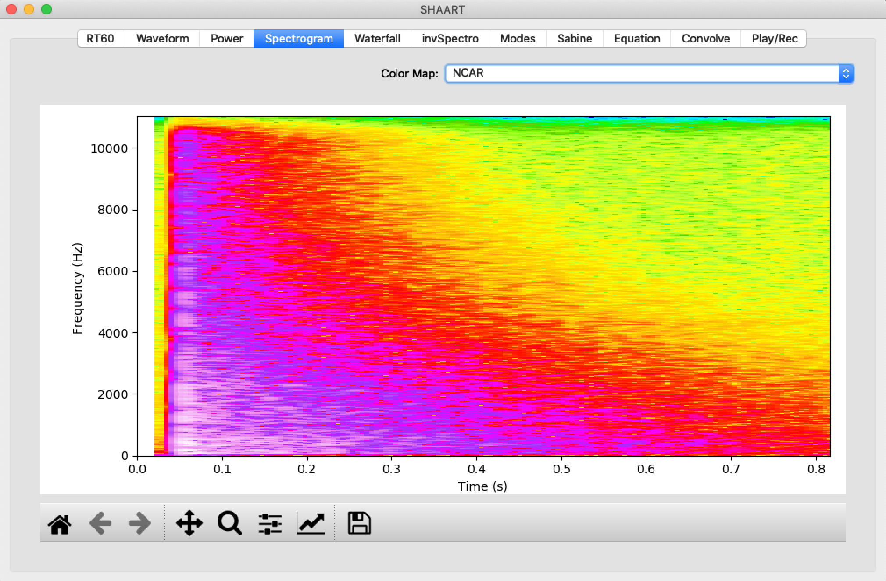


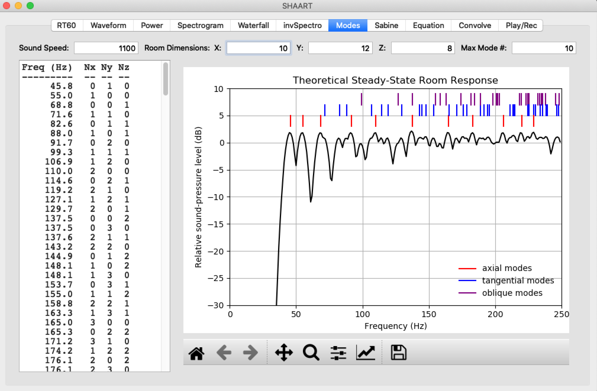

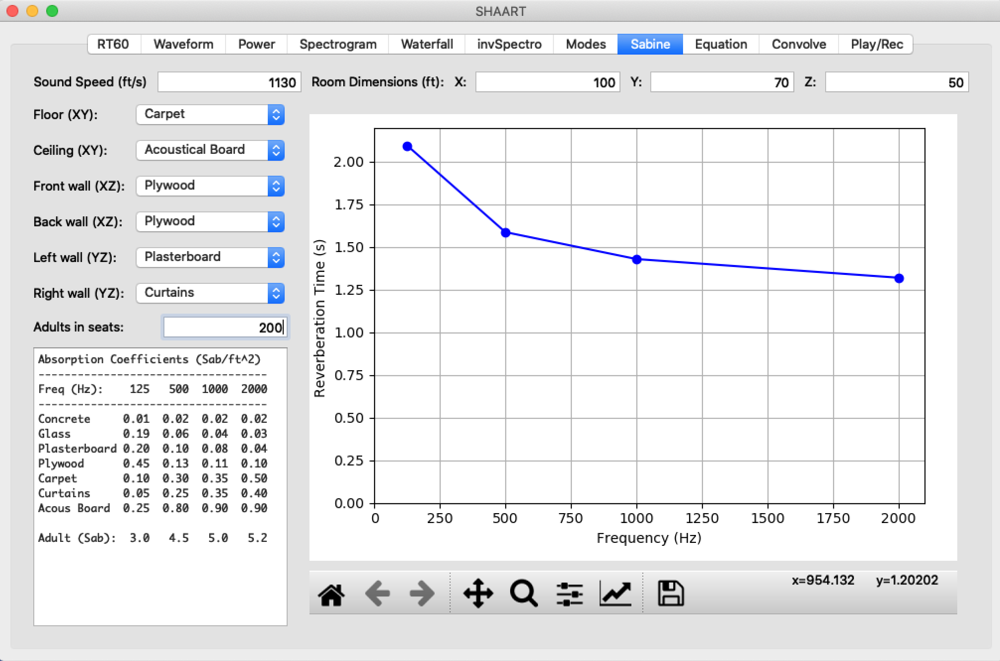


<br>
The "invSpectro" feature created the file [mandrill.wav](audio/mandrill.wav) which has a spectrogram shown below:

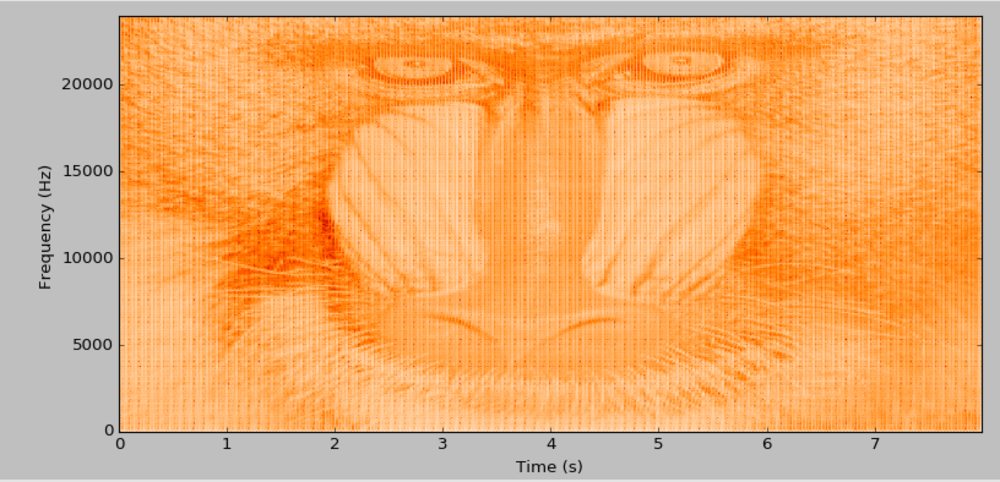
<br>
And interestingly, if the audio is encoded as an MP3, then re-read and re-written as a WAV, one can see the "lossyness" of the MP3:<br>
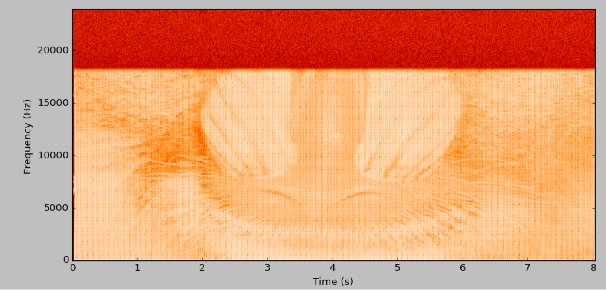
<br>
One can also apply various audio effects to the sound and see the effect on the image, e.g. echo:<br>
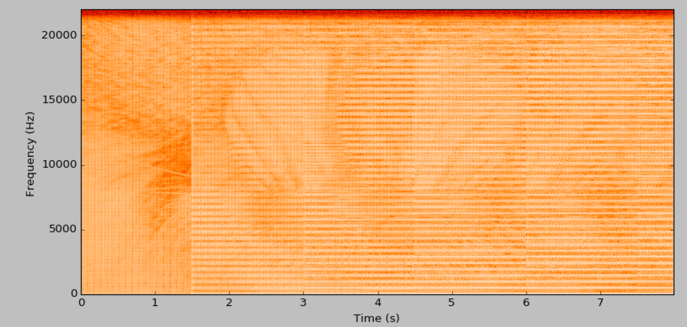

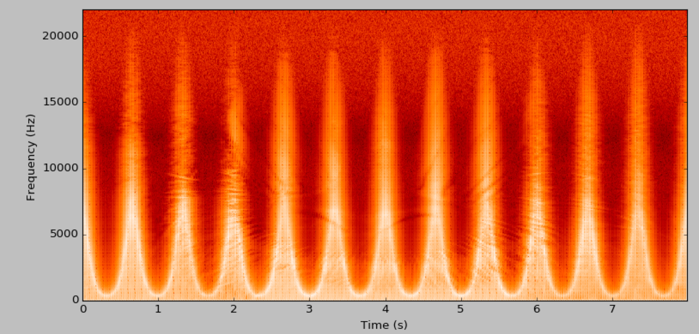

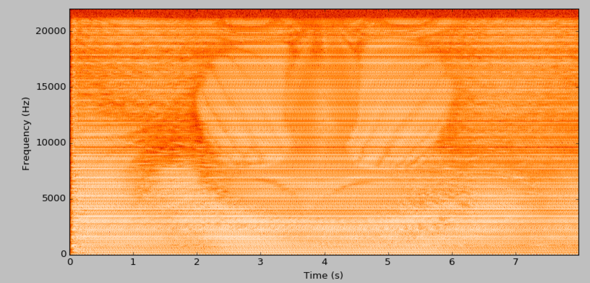

And here's an interesting one: a "leveler" effect:<br>
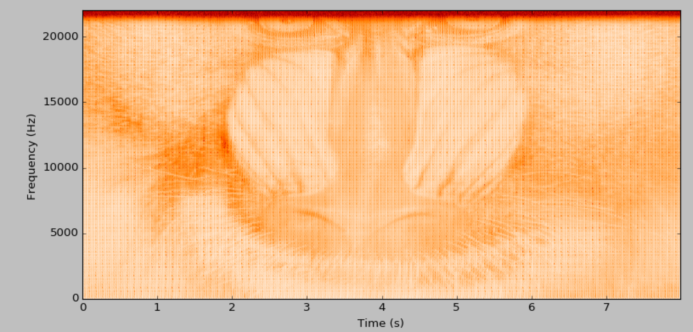
<br>

<a name="source"></a>

## Running from Source
<b>Running SHAART.py from source:</b><br>
Create a new [Anaconda](https://www.anaconda.com/) Python environment and install dependencies, then run...

```bash
cd SHAART/source
conda create --name shaart python=3.7
conda activate shaart
conda install -c numba numba      # numba is optional, actually
conda install -c conda-forge librosa
conda install pyqt pillow pyaudio
python SHAART.py
```


## Building an Executable

First follow the instructions above for running from source using `pyinstaller`, that will create a new directory called `SHAART/source/dist/`, **in which a successful build will result in the presence of working binary executable.**

```bash
conda install -c conda-forge pyinstaller
```

And (because of conflicts) downgrade setuptools too, via `pip`:

```bash
pip install --upgrade 'setuptools<45.0.0'`
```

### Mac

In order to run from source, you'd already need to have XCode, the command-line tools, and HomeBrew installed. Then in we install `python.app` and [an older versions of a few things](https://github.com/pyinstaller/pyinstaller/issues/4067), and build the app:

```bash
conda install python.app joblib=0.11 scikit-learn=0.21.3 librosa=0.6.1
pyinstaller SHAART.spec --specpath=test
```

...and you'll find `SHAART.app` in `source/dist/`.

### Linux (Pop!\_OS / Ubuntu)

There's some conflict between `numba` and `librosa` and `pyinstaller`, and it's currently understood how to best resolve that yet.  So for now, the solution is to remove `numba` and re-install `librosa`and then build:

```
conda remove numba
conda install -c conda-force librosa pyinstaller
pyinstaller SHAART.spec --specpath=test
```

...And then you can just run the `dist/SHAART` executable from the command line.   Note: I can't seem to get it to be a "clickable icon" in Nautilus/Gnome.  Not sure how to do that.

### Windows

Here are the steps taken to build the Window EXE:

1. Download & Install Windows SDK: https://developer.microsoft.com/en-us/windows/downloads/windows-10-sdk/

2. Download & Install Anaconda (64 bit):  https://www.anaconda.com/

3. Run Anaconda Powershell prompt and install requirements:

   ```bash
   conda install -c conda-forge ffmpeg
   conda install -c anaconda pyqt pywin32 pypiwin32
   conda install pyaudio librosa pywintypes
   ```

5. Downgrade `setuptools` to avoid conflicts `pyinstaller` as per https://github.com/pypa/setuptools/issues/1963:
   `pip install --upgrade 'setuptools<45.0.0'`

6. Run `pyinstaller` with these arguments:

   ```bash
   pyinstaller -w --icon=shaart_logo_icon.ico  --hidden-import="pypiwin32" --hidden-import="pywintypes" --hidden-import="sklearn.utils._cython_blas" --hidden-import="sklearn.neighbors._typedefs" --hidden-import="sklearn.neighbors.quad_tree" --hidden-import="sklearn.tree._utils" --onefile SHAART.py
   ```

<hr>
Author: <a href="http://www.scotthawley.com">Scott Hawley</a>
</body>
</html>


## Changing the GUI

Run QT5's `designer` (or `Designer`) app using `ui_shaart.ui` as an input.  Change the GUI as you like, save it, and then to generate the .py file, run

```bash
pyuic5 -x ui_shaart.ui -o ui_shaart.py
```


<a name="faq"></a>

## FAQ

* Can it only read WAV files?  No.  Despite saying WAV file everywhere, the newest version of SHAART will read AIFF files too.  (And any previous issues with reading 24-bit PCM WAV files has been resolved.)
* Can I get a logarithmic frequency scale for the spectrogram?  Not yet, but soon.
* For waterfall plots, it doesn't clear the window if you change the input data, resulting in multiple plots on the same page.  Bug or feature?
* Does the "Record" feature work?  Not yet. Use Audacity or....any other utility to record. ;-)
* How do I contribute to SHAART?  Submit a Pull Request!

<a name="notes"></a>

## Release Notes / Issues
* v0.7:

   * Updated code from Python 2.7 to Python 3.7
   * Updated GUI from Qt4 to Qt5
   * Switched executable build from py2app to PyInstaller, added capability for Windows & Linux executable builds
   * Re-ordered feature panes

* v0.6: Minor improvements to speed and reliability

* v0.5:  

   * Got its own App icon!

   * "Power": Improved power spectrum calculation and display.
   * "Equation": Added equation for inverse exp. sine sweep (with "depinking").
   * Added IR creation tutorial (documentation)


## More docs & info

Purpose:
SHAART is intended as an in-house solution for teaching PHY2010 ("Physics for
Audio Engineering Technology") at Belmont University.  Perhaps others will find
it useful as well.  ...That and the PHY4410 ("Survey of Advanced Physics")
students and I have been learing Python this semester to implement our
simulations and analysis, so writing this also serves as an instructive
exercise in Python programming.

License:
The source code any binaries are free.  Free as in beer, and free as in "do
whatever you want with them."  SHAART was made using code provided by others for
free.   "Freely you have received, freely give."

Nomenclature:
The name is an acronym using the author's initials (S.H.), along with words
like "Acoustic," "Analysis," "Reverberation Time" or "Research Tools" -- as well
as, it is hoped, a lighthearted and not-legally-problematic play on words with
the name of the industry-standard SMAART audio analysis software made by
Rational Acoustics, Inc.  (SHAART is in no way affiliated with SMAART or
Rational Acoustics, fyi.)  ...I mean, "SHAART" is just hilarious to say.

Author: Dr. Scott H. Hawley, Associate Professor of Physics,
        Belmont University, Nashville TN USA.  
Date:   April 6, 2020 (original March 24, 2013)

Contact:  Improvements, bug reports, inquiries, donations, etc.: scott.hawley@(belmont)


List of files:
    SHAART.py         - the main control window, and most of the mode calc's
    rt60widget.py     - most of the rt60 tab functionality
    pwrspecwidget.py  - power spectrum
    spectrowidget.py  - spectrogram
    rcgraphwidget.py  - reverb characteristic graph for the Sabine calc
    waterwidget.py    - waterfall plot
    ui_shaart.ui      - QT Designer file for the user interface
    ui_shaart.py      - auto-generated by pyuic
    setup.py          - used for py2app.  See above.
    shaart_logo.png   - one of the most horrifying graphic designs ever
