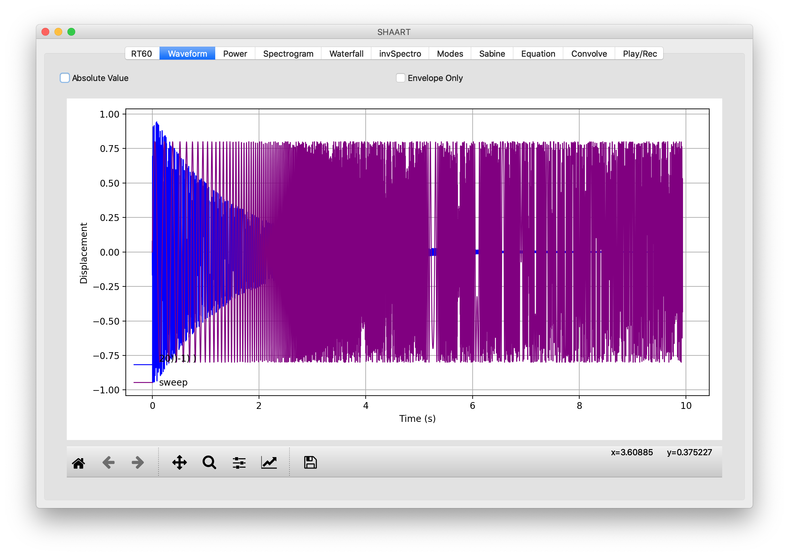

# Creating Impulse Responses with SHAART

1. Create an exponential sine sweep of uniform amplitude.

    - You may create the sweep in SHAART by clicking on the "Equation" tab and leaving the default equation text in place and selecting "Go".  (The default is for a 10 second sweep from 20 Hz to 20000 Hz.)

      ```blah 
      0.8 * sin( 20 *2*PI*TMAX/ln(20000.0/20) * (exp(t/TMAX*ln(20000.0/20))-1) )
      ```

   - Alternatively you may generate a sweep in Audacity by selecting Generate > Chirp and then "Logarithmic". Be sure to set the starting and ending amplitudes to be the same.

2. Play the sweep from your speaker while recording the response.  (SHAART does not currently have recording functions).  Save the response to a WAV file.

3. In SHAART, choose "Equation" and this time copy & paste in the "Inverse Exponential Sine Sweep" equation text...

   ```
   exp(ln(20000.0/20)*(-t)/TMAX) * sin( 20 *2*PI*TMAX/ln(20000.0/20) * (exp((TMAX-t)/TMAX*ln(20000.0/20))-1) )
   ```

   ...and press Go.   This will go into "File A" in SHAART.

4. Load the response WAV file into "File B" in SHAART.

   A comparison of the two files now in memory will look like this:
   

5. Go to the "Convolve" tab and simply press "Go".  (No other instructions or actions are necessary.  Do not time-reverse file A).

6. File A now contains your Impulse Response!
   **TODO:** show screenshot(s) of constructed IR.

## References:

Farina: <a href="http://aurora-plugins.forumfree.it/?t=53443032">http://aurora-plugins.forumfree.it/?t=53443032</a>

Inv Exp Sweep: http://kc.koncon.nl/staff/pabon/IRM/IRMeasurementInstruction/assignment_IR_ExpSweepTheory.htm

---

*Scott H. Hawley*