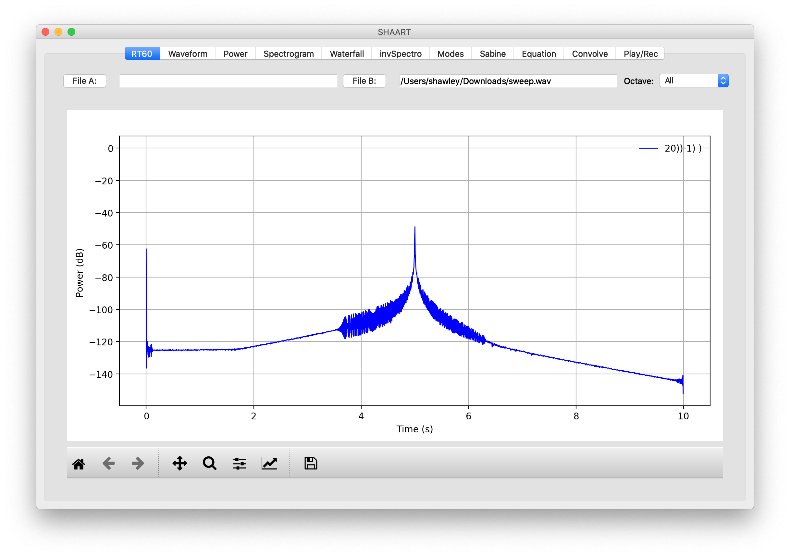

# Creating Impulse Responses with SHAART

<a href="../index.html#downloads">Download SHAART</a>.

Sure, you could press a button and have Room Eq Wizard or FuzzMeasure or Logic do it for you, but what if you want to "see under the hood" a bit, to learn what's really going on?   Here we follow the now-ubiquitous method (and ISO standard) of Farina [1].

1. Create an exponential sine sweep of uniform amplitude.

   - You may create the sweep in SHAART by clicking on the "Equation" tab and leaving the default equation text in place and selecting "Go".  (The default is for a 10 second sweep from 20 Hz to 20000 Hz.)

     ```blah 
     0.8 * sin( 20 *2*PI*TMAX/ln(20000.0/20) * (exp(t/TMAX*ln(20000.0/20))-1) )
     ```

   - Alternatively you may generate a sweep in Audacity by selecting Generate > Chirp and then "Logarithmic". Be sure to set the starting and ending amplitudes to be the same.

2. Play the sweep from your speaker while recording the response.  (SHAART does not currently have recording functions).  Save the response to a WAV file.

3. In SHAART, choose "Equation" and this time copy & paste in the "Inverse Exponential Sine Sweep" [2] equation text...

   ```
   exp(ln(20000.0/20)*(-t)/TMAX) * sin( 20 *2*PI*TMAX/ln(20000.0/20) * (exp((TMAX-t)/TMAX*ln(20000.0/20))-1) )
   ```

   ...and press Go.   This will go into "File A" in SHAART.

4. Load the response WAV file into "File B" in SHAART.  A comparison of the two waveforms now in memory will look like this:
   

5. Go to the "Convolve" tab and simply press "Go".  (No other instructions or actions are necessary.  Do not time-reverse file A).

6. File A now contains your Impulse Response!
   **TODO:** show screenshot(s) of constructed IR.


## Check: IR of a Dry Signal

If we use the "original" (constant-amplitude, forward) sine sweep and convolve it with its "inverse" (exponential-amplitude, backward) sweep, in theory we should get a Dirac delta function (i.e. a "spike") in time and a flat power spectrum.  Let's check:

1. As in Step 1 above, use the Equation feature to generate the forward sweep as File A and save it to a file: `sweep.wav`. 

2. As in Step 3 above, use the Equation feature to generate the 'Inverse filter' as File A (i.e. overwrite what's there), and keep it there.

3. Load back the original sweep file as File B.  (Take a look in the Waveform display. You should see something similar to the screenshot shown in Step 4 above.)

4. Go the Convolve tab and press the big "GO!" button. 

5. Go back to the waveform display to see this 'spike': ...which is not quite perfect but pretty 'impulsive'!  If we look at it on a dB scale (go to the RT60 tab), we see...

   

   ...Defects include the "blip" on the left, and an asymmetry that shows up about 50dB lower than the maximum. I'll look into those.   The spectrogram looks like this:

   **TODO:** Feature Request: add a color bar to the side of the plot so we know the scale of the colors. 

6. Check the power spectrum: Is it flat? Press the Power tab to see this:  ...pretty flat, eh? ;-)   *(And if you change the equations to run from 10 Hz to 22 kHz instead of 20 to 20k it'll look even flatter, but there's not really a point to that because you won't be measuring RT60 in those extra frequency ranges.)*

## References:

[1] Farina's Method: <a href="http://aurora-plugins.forumfree.it/?t=53443032">http://aurora-plugins.forumfree.it/?t=53443032</a>

[2] Inverse Exponential Sweep, see Peter Pabon: http://kc.koncon.nl/staff/pabon/IRM/IRMeasurementInstruction/assignment_IR_ExpSweepTheory.htm

<hr>
Author: <a href="http://hedges.belmont.edu/~shawley">Scott Hawley</a>
</body>
</html>