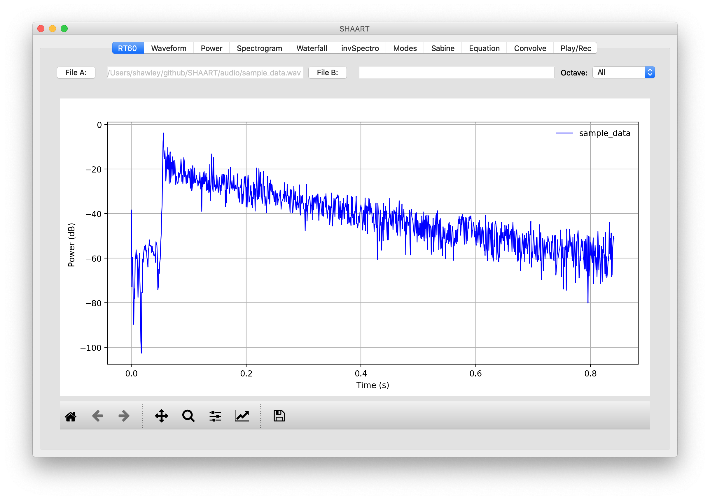
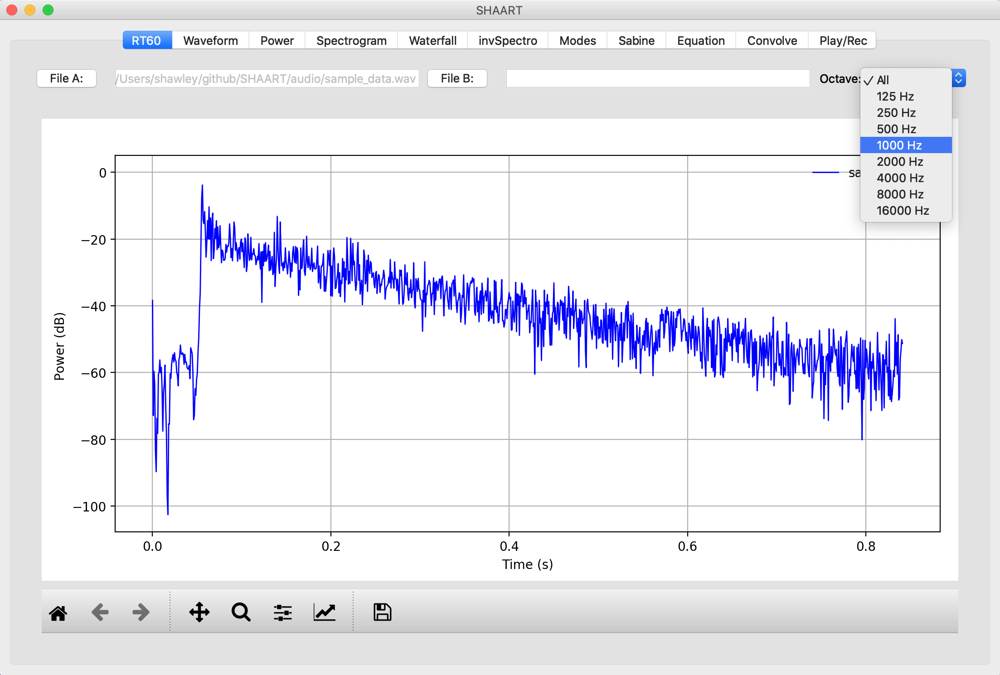
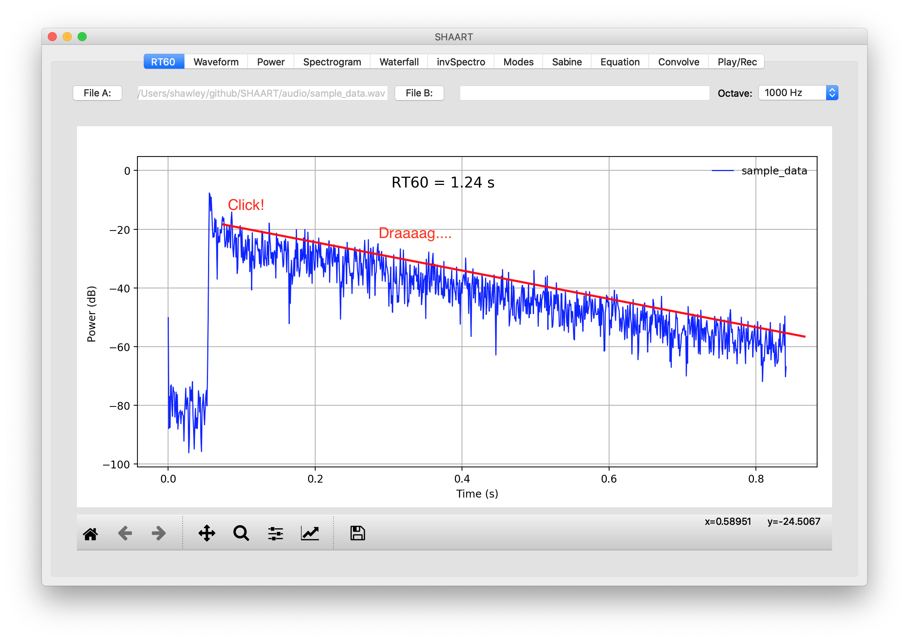
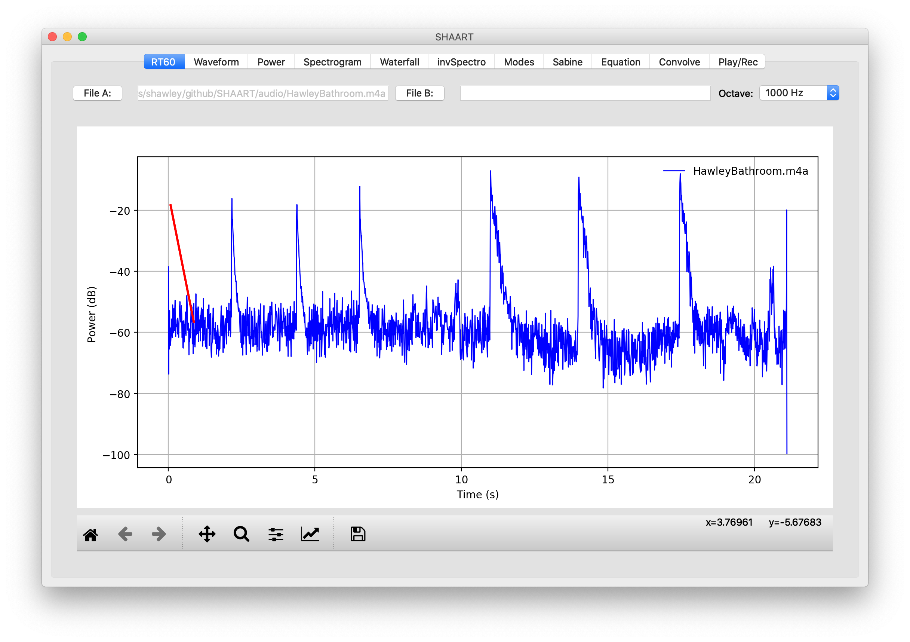
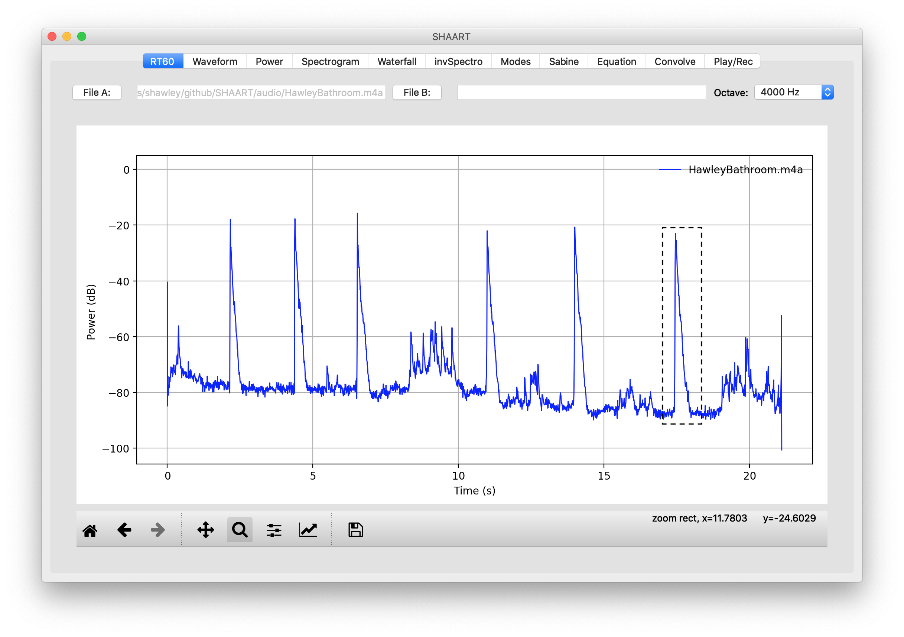
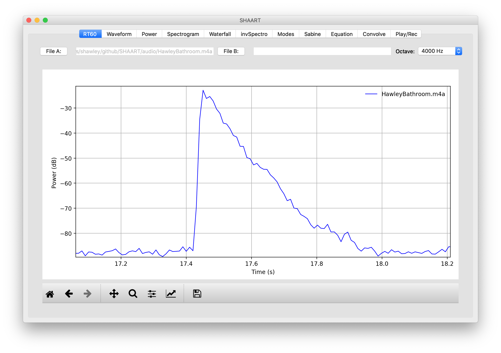
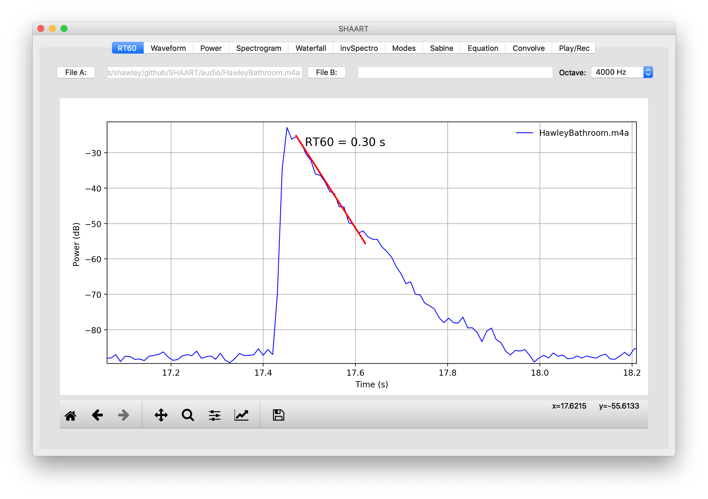
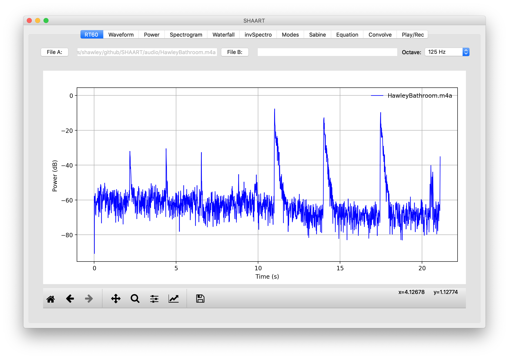

# Measuring Reverb Times with SHAART

<a href="https://hedges.belmont.edu/~shawley/SHAART/index.html#downloads">Download SHAART</a>.

## I. Get a Recording of a Decay

* You can start with a premade recording, such as [sample_data.wav](../audio/sample_data.wav) or [HawleyBathroom.m4a](../audio/HawleyBathroom.m4a) (that I made by clapping and banging a book in my bathroom).

**...Or...** 

* You can record one yourself:
  *  The easist way is to provide some impulse sound such as clapping, popping a balloon or banging a book.  
  * Or, the "proper" way is to digitally contruct an impulse response from sine sweeps; if you want to do that, see the tutorial ["Creating Impulse Responses with SHAART"](ir.md). 

## II. Measure the Reverb Time (Single Decay)
Load the audio file for your recorded decay as File A.  You can also load a second one as File B.  We will use the simple case of one decay given by [sample_data.wav](../audio/sample_data.wav) for what follows. For multiple decays in one recording, see Part III, below. 

1. Initially you see the decay itself, shown without any octave-band filtering:

2. Using the drop-down menu in the upper right, select the octave band you want to filter in, such as 1000 Hz, and release: 

   

3. With your mouse, click near the top of the graph (but ignore the initial peak) and while holding the button down, drag the resulting red line such that it is *parallel* to the overall shape of the decay (it doesn't have to be on top of the decay, just parallel to it).   Also, it doesn't matter how *long* you draw the line, all we care about is the *slope*. 

   

   4. In the top center of the graph, the text "RT60 = 1.24 s" appears.  **That is the reverb time you measured.**  
   5. **Re-measuring:** To re-draw the line, simply click and drag again.  To switch to different octaves, simply change the octave drop-down.

## III. Measuring Reverb Time (Multiple Decays)

In this case we will measure multiple days, contained in [HawleyBathroom.m4a](../audio/HawleyBathroom.m4a).  In this case, we will use the "Zoom" feature provided by the magnifying class icon in the bottom left. 

1. First, we need to load the file and choose and octave; let's do 4 kHz:

   

   Ooops! Notice there's still a red line from the previous measurement, and **even though the Octave filter *says* "1000 Hz", it's really not: THIS IS A BUG.** It's actually showing broad-band (unfiltered) signal.  

2. But when we select the 4000 Hz octave, the display becomes correct: 

     In this example there are 6 decays: the first 3 impulses are from hand claps, and the last 3 are from backing a book on the wall. 

3. Now click the magnifying glass, pick one of those 6 decays, and click-and-drag a a box around it. We'll pick the last decay:  When you release the mouse, they display will be zoomed in on that decay:

    If you want to zoom out and try again, click the "Home" icon in the bottom left.  If you want zoom in even more, click the magnifying class again and draw a new box.

4. At this point, simply & click and draw a red line along the decay, as in the "Single Decay" example above: 

   

   Note that this small bathroom room has a **double-valued reverb time:** This can be seen a bit more obviously in the zoomed-out view, showing a "kink" in the middle of each decay.  This is probably due to the bathroom door having a large opening under it, so that the bathroom is acoustically coupled to the hallway and kitchen outside.  You may notice similar effects for your rooms. 

5. **Bug/Feature:** When you select a new octave band, **SHAART will zoom back out** to the full display.  For example, if we choose 125 Hz octave next, we get this: 

   ...and *every time* we change the octave, it will zoom out. (Note that the 3 hand claps on the left have much less energy at low frequencies than the 3 book-bangs on the right.)  

   This un-zooming behaviour is a "feature" of clearing the display each time we draw a plot; in order to keep the zoom window the same when filtering, it would take a fair amount more coding work -- perhaps a future version of SHAART will be able to do that.

Author: <a href="http://hedges.belmont.edu/~shawley">Scott Hawley</a>
</body>
</html>